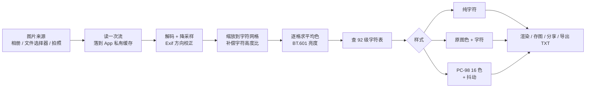
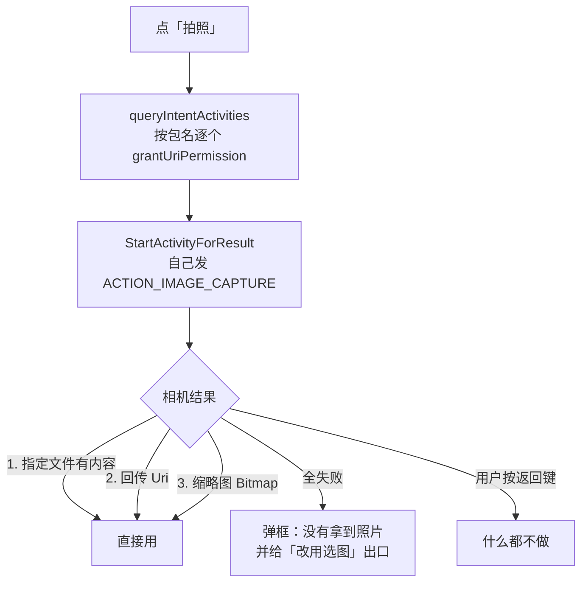

# ASCII 图片转换器

> 一个把照片变成字符画（ASCII Art）的安卓 App，**双向可用**：图片能转成字符画，字符画也能转回图片。
> 从 [tAsciiArtPlayer](https://github.com/Tans5/tAsciiArtPlayer) 的图片转换模块抽出来独立成型，
> 去掉视频播放与文件传输整套依赖，安装包从 43 MB 压到 **1.6 MB**。

`An Android app that converts photos to ASCII art and back. No network, no permissions, 1.6 MB.`

[](../../releases/latest)
[](LICENSE)
[]()

| 项 | 值 |
| --- | --- |
| 包名 | `com.dragonxash.asciiconverter` |
| 版本 | **1.5.0**（versionCode 14） |
| 系统要求 | Android 8.0（API 26）及以上 |
| 联网 | **完全不联网**，转换全程本地跑 |
| 权限 | Android 10+ 上**零权限**（见下） |
| 界面语言 | 简体中文 / English / **日本語** / 跟随系统 |
| 体积 | release 包 1.60 MB |

---

## 一、快速开始

### 装到手机

到 [Releases](../../releases/latest) 下载 **`ascii-image-converter-1.5.0.apk`**（1,679,036 字节）直接装。

```
sha256  b772fe166a8700483abba678a9afc018ca6a213a8a1bf16c960ddea76e66959c
```

仓库 `AsciiConverterApp/deliver/` 下也有一份同哈希的副本（文件名是中文的 `ASCII图片转换器-1.5.0.apk`，
与 Release 附件是同一个文件；Release 附件用 ASCII 文件名只是为了下载链接稳定）。

> 提示「未知来源应用被禁止」时，去系统设置给对应的文件管理器/浏览器开一下
> 「允许安装未知应用」。从 1.0.0 到 1.5.0 包名与签名密钥从未变过，**任何历史版本都能直接覆盖安装**。

### 自己编译

工程在 `AsciiConverterApp/`，带 Gradle wrapper（Gradle 8.14.3）：

```bash
cd AsciiConverterApp

# 调试包
./gradlew assembleDebug

# release 包（需要先配好签名，见「签名」一节）
./gradlew assembleRelease
```

需要本机有 **JDK 21** 与 **Android SDK（platform 36 + build-tools 36.0.0）**。
仓库根目录的 `build-app.sh` 是原始项目用的一键脚本，它假设工作区里存在 `.build-env/`
（便携 JDK/SDK/Gradle，**不在本仓库内**），克隆下来直接用 `./gradlew` 即可。

### 跑校验脚本

项目不带单元测试，改用 **21 个静态校验脚本**把算法常量、字符串格式、源码结构、界面语言配置钉住：

```bash
# 根目录 11 个：字符表常量、占位符、源图链路、抖动、调色板、ANSI 往返、伪彩、量化、
#              release 字符表、预览缩放、界面语言
for f in verify_*.py; do python "$f" && echo "PASS $f"; done

# deliver/ 下 10 个（同一批脚本，从交付目录再跑一遍，防止路径写死导致的假通过）
cd AsciiConverterApp/deliver
for f in verify_*.py; do python "$f" && echo "PASS $f"; done
```

`verify_consts.py` 需要 `repo/` 与 `lib-ref/` 两个目录在场（本仓库已包含），
所以它只留在根目录、不进 `deliver/`。

---

## 二、它是怎么工作的



**核心是 BT.601 亮度 + 92 级字符表，逐格映射**：

1. 按「字符宽度」把原图缩放到对应的字符网格。字符本身不是 1:1 高宽比，
   所以纵向要多除一个比例系数，否则画面会被压扁。
2. 每个网格单元求平均颜色，算亮度 `luma = 0.299R + 0.587G + 0.114B`。
3. 亮度去查 92 项字符表（从最稀疏的空格一路排到最密的 `@`）：

   ```
    .-':_,^=;><+!rc*/z?sLTv)J7(|Fi{C}fI31tlu[neoZ5Yxjya]2ESwqkP6h9d4VpOGbUAKXHm8RD#$Bg0MNWQ%&@
   ```

   这套逻辑与原仓库 `AsciiArtImageFilter` 的 GLSL 实现**逐字节对齐，算法未改动**。
4. 逐格绘制：先铺底色（彩色填充就垫原图颜色），再把字符画上去。

**反向（字符画 → 图片）**：每个字符在 92 级表里的下标反查回亮度，重建灰度网格，
走同一套渲染。已用 Python 验证：92 个字符全能定位，亮度来回转换**最大偏差 1 级**
（平均 0.196 级）。

### PC-98 画风（在 `Pc98Quantizer` 里）

**第一步，量化**——中位切分（median cut）从画面里挑 ≤16 个代表色。
两个容易写错、且都会白白浪费色位的地方：

- **判停看「不同颜色的个数」，不能看「桶的个数」**。平均色会被吸附到 12 位网格上，
  两个不同的桶很容易撞到同一格点，按桶数判停会剩一堆重复色（实测 16 个槽位只给出 6 种色）。
- **选桶要按「桶内还有几种量化色」挑，不能只看原始通道跨度**。按跨度挑会挑到
  「跨度很大但量化后只有一种色」的桶，白劈一次。

大块平涂的画面（正是 PC-98 CG 那种）最容易踩这两个坑。

**第二步，抖动**——三档：

| 档位 | 做法 |
| --- | --- |
| 不抖动 | 每格取最近色，加权距离 `3R² + 6G² + B²`（权重偏绿，接近人眼） |
| 网点抖动 | Bayer 8×8 阈值矩阵加固定偏移。偏移幅度取「调色板内相邻两色的平均距离」，**不用魔数**，换任何一套 16 色都能自适应 |
| 误差扩散 | Floyd–Steinberg，按 7/16、3/16、5/16、1/16 摊给右邻与下一行；用浮点缓冲带上小数，否则误差会被截断抹平 |

### 零权限是有意设计的

release 包实际只声明两条 `maxSdkVersion=28` 的存储权限，**Android 10+ 上等于零权限**。
整条链路都建立在「无需权限的系统 API」上：

| 场景 | 用的 API | 为什么不需要权限 |
| --- | --- | --- |
| 从相册选图 | 照片选择器 `PickVisualMedia` | 用户选中的那一个文件即授权 |
| 从文件里选图 | SAF `OpenDocument` + 持久化读权限 | 同上 |
| 拍照 | `ACTION_IMAGE_CAPTURE` + FileProvider + **显式 `grantUriPermission`** | 写文件的是系统相机 App，我们只拿 Uri |
| 存图到相册 | `MediaStore` insert | API 29+ 分区存储下插入自己的媒体不需要权限 |

**拍照那条是 1.4.5 最贵的一课**：`grantUriPermissions="true"` 只是「**允许**授权」，
≠「已授权」。androidx 的 `ActivityResultContracts.TakePicture()` 的 `createIntent`
**只做 `putExtra(EXTRA_OUTPUT, uri)`、一次 `addFlags` 都没有**（反汇编 1.11.0 确认）
→ 相机没有写权限 → 我们指定的文件是 **0 字节**。



三条回退路 + 全失败必须弹框（**不能静默 return**），否则用户看到的就是
「拍完回来还显示『还没有图片』，而且一声不吭」。

---

## 三、验证记录

本项目**从头到尾没有真机 / 模拟器**，所有结论都来自
「编译验证 + 包内核对 + 算法级离线验证」。诚实列出：

| 验证项 | 方法 | 结果 |
| --- | --- | --- |
| 编译 | `assembleRelease` + `assembleDebug` | `BUILD SUCCESSFUL` |
| 代码级编译警告 | `grep -c "^w: file://"` 构建日志 | **0 条** |
| 静态校验脚本 | 根目录 11 个 + `deliver/` 10 个 | **21/21 PASS** |
| 界面语言四处配置 | 枚举 ↔ `res/values-*` ↔ `locales_config` ↔ `localeFilters` | 对齐；三语言键集与占位符零偏差 |
| 日文资源是否真进包 | `aapt2 dump badging` / `dump resources` + 字节层复核 `resources.arsc` | `locales: '--_--' 'en' 'ja'`；`app_name` 有 `(ja) "ASCII 画像コンバーター"` |
| 字符表常量 | 与上游 GLSL 逐字节比对，Python 复刻查表 | 一致（含「源码注释写 95 级、实测 92 项」的修正） |
| 亮度往返 | 92 字符全量转换 | 最大偏差 1 级，平均 0.196 级 |
| release 包内容 | ZIP 条目级比对（781 条 CRC/尺寸/时间戳） | 与交付包**全部一致** |
| 签名 | `apksigner verify --print-certs` | v2 方案通过，RSA 2048，证书 SHA-256 `37c4513…` |
| 体积 | 与上一版对比 | release 1.60 MB（原 App 43 MB；1.5.0 比 1.4.5 多 13.5 KB，正是日文资源） |

### 一个容易误判的点：重建包的哈希和交付包不一样

在本机重新编译出的 release APK，**字节数与交付包相同（1,665,512 B），但 sha256 不同**。
这不是损坏——逐层查证过：

| 比对层 | 结果 |
| --- | --- |
| ZIP 条目集合 | 781 条完全相同，无增无减 |
| 逐条 CRC / 压缩尺寸 / 时间戳 | 全部一致 |
| 字节差异 | 4435 字节，**全部落在 APK 签名块内**（`v2 签名块 0x7109871a` 与 `verity padding 0x42726577` 逐字节相同） |
| 差异所在子块 | 一个 id 为 `0x504b4453` 的辅助块，公开 APK 签名规范未收录，高熵、每次构建都变 |

**已验证的**：受 v2 签名保护的内容与 **v2 签名块本身都逐字节一致**，
4435 字节的差异 100% 落在那一个 `0x504b4453` 子块里——它高熵（99.4% 的字节都不同）、
不含可读字符串、也不是压缩流，且**每次构建都变**。

**倾向的解释（推断，未证实）**：RSA PKCS#1 v1.5 签名本身是确定性的——这正好解释了
为什么 v2 签名块能逐字节相同——所以差异只能来自签名块里那部分与构建相关的内容，
**最可能是签名块的随机填充**。该块的确切用途没能在公开规范里找到；
要定论得去查 apksig 源码，**这里不下这个结论**。

**无论如何都不影响可安装性与内容完整性**：`apksigner verify` 通过、证书指纹一致、
781 个 ZIP 条目逐字节相同。
→ 跨机重建的包不能用交付哈希表校验；要证明内容一致就比 ZIP 条目。

> 顺带一条教训：**别手写解析 APK 签名块来判断签名算法**。签名算法 ID 是嵌在
> 多层 length-prefixed 结构里的，很容易读错（本次就误读成了 ECDSA，实际是 RSA）。
> 要算法就调 `apksigner verify --print-certs` 或 `keytool -list -v`，别自己数字节。

---

## 四、已知限制（未验证的东西）

**必须说清楚**：

- **全程没有真机 / 模拟器**。所有「修好了」的结论机制链是完整的（有的甚至是反汇编定下来的），
  但**手感类的东西一律没验过**。
- **1.4.5 的拍照修复**：那台机器上「拍照」最终交给哪个应用这边看不到，
  所以「回传 Uri / 缩略图 Bitmap」两条回退路够不够用，**只能上手看**。
- **1.4.4 的甩动手感、1.4.3 的缩放手感没验过**——手势是静态校验一条都测不出来的东西。
- **1.4.1 修的相册 `ENOENT`** 只在一加 13（ColorOS / Android 15）上复现过，
  「原来真的只开了一次流」这个前提没在真机验。
- **1.4.2 的批量页 SAF 多选入口**，一次都没在真机上点过。
- **1.4.0 的「文字结果」闪退**根因是推出来的（占位符类型不匹配），没复现过原始崩溃。

**待办**

- 「文字结果」面板（固定 240dp 高的小框）**只能滚不能缩放**——它是
  `ScrollView` + `HorizontalScrollView`，要加缩放得单配一套「文字不换行」的测量规则。
- 缩放倍数记忆——现在换图固定回 1×。

---

## 五、文件结构

```
.
├── AsciiConverterApp/            ← App 工程主体
│   ├── app/
│   │   ├── build.gradle.kts      ← 签名配置从 keystore.properties 读取（见「签名」）
│   │   ├── proguard-rules.pro
│   │   └── src/main/             ← 18 个 Kotlin + 33 个布局/资源
│   ├── gradlew / gradle/wrapper/ ← Gradle 8.14.3 wrapper
│   └── deliver/                  ← 交付目录
│       ├── ASCII图片转换器-1.5.0.apk
│       ├── app-debug.apk
│       ├── README-ASCII图片转换器.md   ← 完整说明（功能/算法/FAQ）
│       ├── 更新说明-1.0.2 ~ 1.5.0.md   ← 每版的根因 / 改法 / 验证
│       ├── 排错说明-如何取错误详情.md
│       ├── pc98画风教程/               ← 4 组对比图 + 可运行 Python demo
│       ├── verify_*.py                ← 10 个校验脚本
│       └── old/                       ← 历史版本 APK 归档
├── verify_*.py                   ← 11 个校验脚本（含需 repo/ 与 lib-ref/ 的 verify_consts.py）
├── build-app.sh / build.sh       ← 原始一键构建脚本（依赖工作区里的 .build-env，不在仓库内）
├── gen_*.py / extract_table.py   ← 图标与常量生成脚本
├── repo/                         ← 参考实现 tAsciiArtPlayer 源码快照（Apache-2.0，见 NOTICE）
├── lib-ref/                      ← 从参考实现抽出的比对用片段（Apache-2.0，见 NOTICE）
└── deliver/                      ← 独立成 App 之前给上游做的图片转 ASCII 补丁与 demo
```

### 签名

**keystore 不在本仓库里。** 要出签名 release 包：

`AsciiConverterApp/keystore/asciiconverter.jks` 放好密钥，再在 `AsciiConverterApp/` 下建
`keystore.properties`（已被 `.gitignore` 忽略）：

```properties
storeFile=keystore/asciiconverter.jks
storePassword=<你的口令>
keyAlias=asciiconverter
keyPassword=<你的口令>
```

没有该文件时 release 会打成**未签名**包，仍然能正常编译，克隆下来直接构建不会卡住。

公开的证书指纹（可用来核对你手上的 APK 是否出自同一密钥）：

| 项 | 值 |
| --- | --- |
| 密钥算法 | RSA 2048 |
| 证书 SHA-256 | `37c4513128ebfa3c7162eadbd92f1acc12e71ece6e6421d4d5b4fc8163dbb369` |
| 证书 SHA-1 | `667db71aa3377491cc789b5e2f7c47b94c296c24` |

```bash
apksigner verify --print-certs 你的.apk
```

### 加一门语言要动**四处**（少了任何一处都是静默失效）

界面语言由 `core/AppLanguage.kt` 的枚举驱动，新增一门语言必须同时改这四处——
**漏掉任何一处都不会报错**，只会"选了没反应"或"部分界面还是旧语言"：

| # | 位置 | 漏掉会怎样 |
| --- | --- | --- |
| 1 | `core/AppLanguage.kt` 的枚举项 + `selectable` | 语言菜单里根本没有这一项 |
| 2 | `res/values-<tag>/strings.xml` 补齐**全部**键 | 缺的键**静默回退成中文**（不报错），界面里会中英混杂 |
| 3 | `res/xml/locales_config.xml` 加 `<locale>` | Android 13+ 系统设置里看不到这门语言 |
| 4 | `app/build.gradle.kts` 的 `localeFilters` 加 `<tag>` | **资源被 aapt 直接裁掉** → 装机后"选了没反应、还是中文"，而本地编译毫无异常 |

第 4 条最容易漏：`localeFilters` 是个**白名单**，加了资源目录却没加进白名单，
编译器一个字都不会说。这四处的一致性由 `verify_locales.py` 钉住（20 项，含反向验证）。

翻译时还要注意：`%1$s` / `%2$d` 这类**格式占位符必须原样保留**（少一个会在运行时闪退），
字面量 `%` 必须写成 `%%`，换行用 `\n`。

> 顺便说明：默认资源 `values/` 本身就是中文，所以**没有 `values-zh/` 目录**，
> aapt2 报的语言列表是 `locales: '--_--' 'en' 'ja'`，其中 `--_--` 就是那份中文默认资源。

### 技术栈

| 项 | 版本 |
| --- | --- |
| AGP | 8.11.1 |
| Kotlin | 2.2.0 |
| Gradle | 8.14.3 |
| compileSdk / targetSdk | 36 |
| minSdk | 26 |
| Java 目标 | 17（用 JDK 21 编即可） |
| UI | 传统 View + ViewBinding（`ZoomPaneLayout` 为自写缩放容器） |

---

## 六、版本沿革

| 版本 | 主题 |
| --- | --- |
| **1.5.0** | **新增日文界面**（第 3 门语言）。只多了语言，**转换算法一点没动** |
| **1.4.5** | 修「点拍照 → 选图 → 回来还是『还没有图片』」（三重静默失效叠加） |
| **1.4.4** | 修「放大后一挪动就跳回左上角」（`OverScroller.fling()` 起始位置写成 `0, 0`） |
| **1.4.3** | 预览区双指缩放（自写 `ZoomPaneLayout` 顶掉 `ScrollView`） |
| **1.4.2** | 批量页补「文件浏览器」入口（SAF 多选），整批失败时给换道出口 |
| **1.4.1** | 修「系统相册选的图读不出来（ENOENT）」——改成选图时读一次、之后只读本地 |
| **1.4.0** | 修文字结果闪退与预览着色 OOM；宽度上限 256→1024；新增 PC-98 画风 |
| **1.3.0** | 「只保留色块」开关；顺手修掉浪费 PC-98 色位的量化 bug |
| **1.2.0** | txt 真彩：ANSI 24 位真彩 + PC-98 16 色 |
| **1.1.x** | 双向打通（文字导出/导入）；修彩色风格与语言两个叠加 bug |
| **1.0.x** | 独立成 App；加错误取证；修 `ENOENT` 与界面固定中文 |

每版的根因、改法与验证见 `AsciiConverterApp/deliver/更新说明-*.md`。

---

## 七、参考与致谢

- **[Tans5/tAsciiArtPlayer](https://github.com/Tans5/tAsciiArtPlayer)** — Apache License 2.0。
  本项目的字符画算法（BT.601 亮度 + 92 级字符表）与部分资源移植自该项目；
  `repo/`、`lib-ref/` 与 `deliver/image-ascii-support.patch` 均与其相关。
  **详细署名与许可条款见根目录 [`NOTICE`](NOTICE)。** 本项目与 Tans5 无隶属或背书关系。

## 八、许可

- 本项目原创部分（`AsciiConverterApp/`、校验脚本、文档等）：**MIT**，见 [`LICENSE`](LICENSE)
- 第三方部分（`repo/`、`lib-ref/`、`deliver/image-ascii-support.patch`）：**Apache License 2.0**，见 [`NOTICE`](NOTICE)

## 免责声明

代码按「原样」提供，不附带任何担保。安装第三方来源的 APK 存在风险，请自行判断。
App 不联网、不上传任何图片，但请仍以你自己手机上的实际行为为准。
